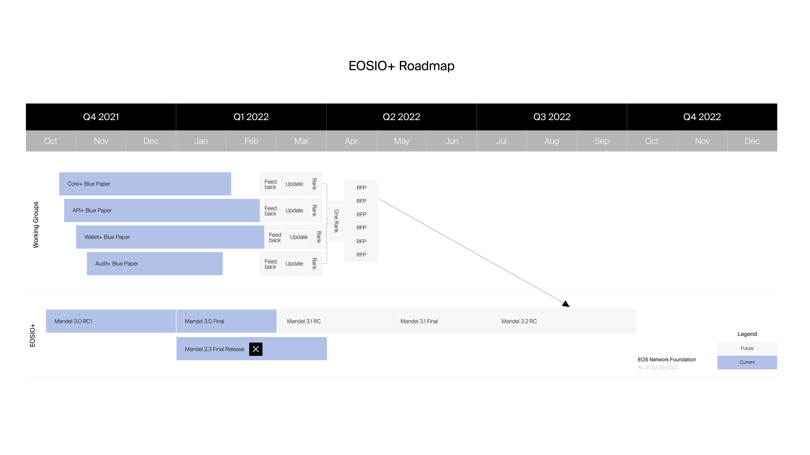

# EOSIO+ Path to Roadmap Proposal

Proposal to the EOSIO+ Working Group - 2022-02-24

Please send comments to ted@eosn.foundation or add them directly to this document.

## Introduction

It is important for the EOSIO+ Working Group to demonstrate a process and narrative for how it will drive the future &quot;EOSIO+&quot; (name to be changed) technology roadmap. This document is a first draft proposal of such a process for the group to discuss, modify and eventually ratify. This will allow the group to forward the narrative, via a blog post, of the progress it has been making over the past several months.

## High-Level Process Steps

Currently four Blue Papers are underway by separate Working Groups. The main focus of this proposal is to outline how the Blue Paper based groups (Core+, Api+, Wallet+, and Audit+) will be delivered, reviewed, consolidated, ranked, funded, and then integrated into a roadmap spanning multiple releases over several quarters.

At its highest level the major steps are as follows:

1. Each Blue Paper is completed by its authors
2. Each Blue Paper is put up for _potentially compensated_ review which includes:
   a. Proposing an **Alternative** to any solution or section in the whitepaper
   b. Proposing an **Enhancement** to and solution or section
   c. Proposing an **Additional** solution or section that may have been missed
   d. Each of these submissions of feedback will be compensated (outlined in blog)
3. The authors of the Blue Papers will accept or reject each area of feedback
   a. Acceptance will increase the compensation to the reviewers
4. The ENF will integrate and publish the feedback as the &quot;Final&quot; versions
5. Each Blue Paper&#39;s solutions will be broken into separate SOWs
   a. There are currently 7 proposed solutions in the Audit+ Blue Paper for example
   b. The API+ Blue Paper has 8 proposed solutions.
   c. The Core+ Blue Paper has approximately **XX** proposals in it.
   d. Each of these proposals will become a prioritized, approved or rejected SOW
6. The EOSIO+ Working Group will vote on priority of each of the Blue Paper SOWs
   a. Each chain would submit their priority in order
   b. Some items can be marked &quot;not prioritized&quot; if they are not critical to that group
7. EOSIO+ Working Group would then vote on overall priority integration
   a. Merging of the four prioritized lists from the individual blue papers
8. The top &quot;N&quot; SOWs would then have their costs and timelines estimated
   a. The original authors of the Blue Paper will be given first priority
   b. If the original author bid was deemed too expensive or excessive timeline
      i. The SOW will be put out in an RFP for any developers to bid
9. The approved SOWs bids then would be organized into &quot;EOSIO&quot; Releases
   a. Whatever EOSIO replacement name is chosen
   b. Called Mandel 3.2, 3.3, etc for now
10. Future releases can always be modified as operating needs are identified
   a. In other words, the roadmap is a living document, and not set in stone

## Example Roadmap

The following roadmap attempts to depict this process. Note that some dates will move as further clarity on Mandel 3.1, etc. is obtained. A roadmap is a living document with continual revisions - thus the date in the lower right hand corner. Here are two versions as we work through tools, fonts, etc.

Alternate version - easier to read in Markdown for now.  Below version has had updates since abover version was created.

## Modify and Approve This Process

As per the conversation in the EOSIO+ Working Group, if we do not publish and control the narrative, others will. Once we modify this proposal to the group&#39;s liking, we can publish a blog post explaining how we are creating the Roadmap _by the community and for the community_. We will gain back the narrative and make it clear - we are seeking feedback on each section of the Blue Papers. We are not dictating the future - but facilitating it for the Public Good of the community by the community. That should sell somewhat better than some of the alternatives.

## Publish and Control the Narrative
Once a process for greating our roadmap has been approved, the ENF will create a publish a blog post that starts to control the narrative of how we are publishing the EOSIO+ software.
